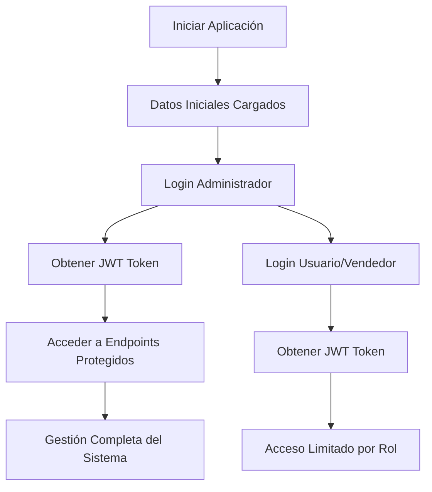
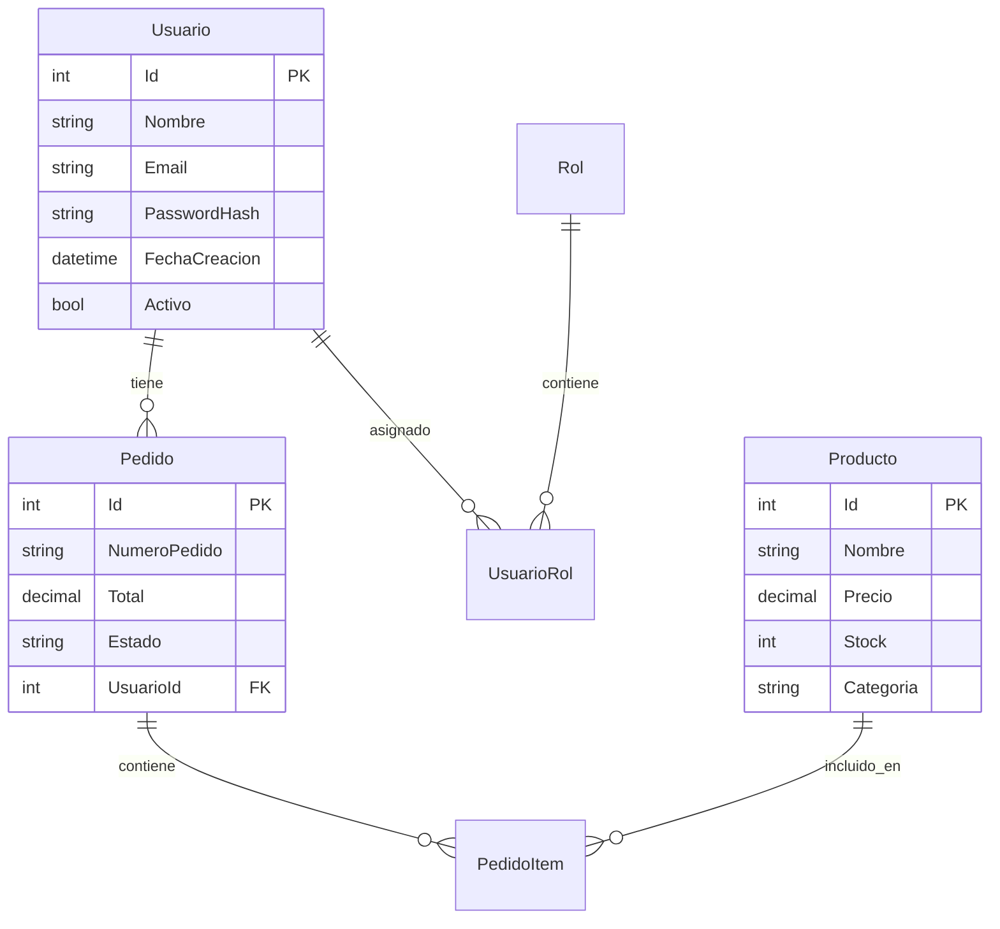

# 🚀 Backend API - Sistema de Gestión de Pedidos Empresarial

## 📋 Resumen Ejecutivo

API REST empresarial desarrollada en **.NET 8** con **ASP.NET Core** que implementa un sistema completo de gestión de usuarios, productos y pedidos. La solución demuestra **excelencia técnica** mediante la implementación de **Clean Architecture**, principios **SOLID**, patrones de diseño avanzados y mejores prácticas de la industria.

## 🎯 Características Técnicas Destacadas

### 🏗️ **Arquitectura y Patrones**
- ✅ **Clean Architecture** - Separación clara de responsabilidades en 4 capas
- ✅ **SOLID Principles** - Código mantenible, extensible y testeable
- ✅ **CQRS Pattern** - Separación de comandos y consultas con MediatR
- ✅ **Repository Pattern** - Abstracción del acceso a datos
- ✅ **Dependency Injection** - Inyección de dependencias nativa

### 🔐 **Seguridad Empresarial**
- ✅ **JWT Authentication** - Autenticación basada en tokens
- ✅ **Password Hashing** - BCrypt para seguridad de contraseñas
- ✅ **Refresh Tokens** - Renovación automática de sesiones
- ✅ **Authorization** - Control de acceso granular
- ✅ **Input Validation** - FluentValidation para validaciones robustas

### ⚡ **Performance y Escalabilidad**
- ✅ **Paginación Avanzada** - Respuestas optimizadas para grandes volúmenes
- ✅ **Filtros y Búsqueda** - Consultas eficientes con Entity Framework
- ✅ **Logging Estructurado** - Serilog para monitoreo y debugging
- ✅ **Health Checks** - Monitoreo de estado de la aplicación
- ✅ **Async/Await** - Programación asíncrona en toda la aplicación

### 🧪 **Calidad y Testing**
- ✅ **Unit Tests** - Cobertura de pruebas con xUnit y Moq
- ✅ **Integration Tests** - Pruebas de integración preparadas
- ✅ **Code Coverage** - Análisis de cobertura de código
- ✅ **FluentAssertions** - Assertions legibles y mantenibles

### 🚀 **DevOps y Despliegue**
- ✅ **Docker** - Containerización completa
- ✅ **CI/CD Pipeline** - GitHub Actions automatizado
- ✅ **Database Migrations** - Entity Framework migrations
- ✅ **Environment Configuration** - Configuración por ambientes

## 🏗️ Arquitectura de la Solución

### **Clean Architecture - 4 Capas**

```
📁 src/
├── 🎯 BackendAPI/                 # API Layer (Controllers, Program.cs, Startup)
├── 🧠 BackendAPI.Application/     # Application Layer (CQRS, Services, Validators)
├── 🏛️ BackendAPI.Domain/          # Domain Layer (Entities, Interfaces, DTOs)
└── 🔧 BackendAPI.Infrastructure/ # Infrastructure Layer (Data Access, Repositories)

📁 tests/
└── 🧪 BackendAPI.Tests/           # Unit & Integration Tests
```

### **Stack Tecnológico Empresarial**

| Categoría | Tecnología | Versión | Propósito |
|-----------|------------|---------|-----------|
| **Framework** | .NET 8 | Latest | Runtime y Framework principal |
| **Web API** | ASP.NET Core | 8.0 | API REST con características empresariales |
| **ORM** | Entity Framework Core | 8.0 | Mapeo objeto-relacional |
| **Base de Datos** | SQLite | 3.x | Base de datos ligera y portable |
| **Autenticación** | JWT Bearer | 8.0 | Autenticación basada en tokens |
| **Validación** | FluentValidation | 11.8 | Validaciones robustas y legibles |
| **Logging** | Serilog | 8.0 | Logging estructurado empresarial |
| **Testing** | xUnit + Moq | Latest | Framework de pruebas unitarias |
| **Containerización** | Docker | Latest | Despliegue consistente |
| **CI/CD** | GitHub Actions | Latest | Automatización de despliegue |

## 🌐 API Endpoints - Documentación Completa

### 🔐 **Autenticación (Público)**
| Método | Endpoint | Descripción | Autenticación |
|--------|----------|-------------|---------------|
| `POST` | `/api/auth/register` | Registrar nuevo usuario | ❌ No requerida |
| `POST` | `/api/auth/login` | Iniciar sesión | ❌ No requerida |
| `POST` | `/api/auth/refresh` | Renovar token de acceso | ❌ No requerida |
| `POST` | `/api/auth/logout` | Cerrar sesión | ❌ No requerida |

### 👥 **Gestión de Usuarios (Protegido)**
| Método | Endpoint | Descripción | Autenticación |
|--------|----------|-------------|---------------|
| `GET` | `/api/usuarios` | Listar usuarios con paginación | ✅ JWT Requerido |
| `GET` | `/api/usuarios/{id}` | Obtener usuario por ID | ✅ JWT Requerido |
| `POST` | `/api/usuarios` | Crear nuevo usuario | ✅ JWT Requerido |

### 📦 **Gestión de Productos (Protegido)**
| Método | Endpoint | Descripción | Autenticación |
|--------|----------|-------------|---------------|
| `GET` | `/api/productos` | Listar productos con paginación | ✅ JWT Requerido |
| `GET` | `/api/productos/{id}` | Obtener producto por ID | ✅ JWT Requerido |
| `POST` | `/api/productos` | Crear nuevo producto | ✅ JWT Requerido |

### 🛒 **Gestión de Pedidos (Protegido)**
| Método | Endpoint | Descripción | Autenticación |
|--------|----------|-------------|---------------|
| `GET` | `/api/pedidos` | Listar pedidos con paginación | ✅ JWT Requerido |
| `GET` | `/api/pedidos/{id}` | Obtener pedido por ID | ✅ JWT Requerido |
| `POST` | `/api/pedidos` | Crear nuevo pedido | ✅ JWT Requerido |

### 🏥 **Monitoreo y Salud**
| Método | Endpoint | Descripción | Autenticación |
|--------|----------|-------------|---------------|
| `GET` | `/health` | Estado de la aplicación | ❌ No requerida |
| `GET` | `/swagger` | Documentación interactiva | ❌ No requerida |

## 🚀 Instalación y Configuración

### 📋 **Prerrequisitos del Sistema**

| Componente | Versión Mínima | Descripción |
|------------|----------------|-------------|
| **.NET 8 SDK** | 8.0.0+ | Framework principal |
| **Visual Studio 2022** | 17.8+ | IDE recomendado (opcional) |
| **SQLite** | 3.x | Base de datos incluida |
| **Docker Desktop** | 4.0+ | Para containerización (opcional) |
| **Git** | 2.30+ | Control de versiones |

### 🛠️ **Instalación Local (Desarrollo)**

#### **Paso 1: Clonar el Repositorio**
```bash
git clone <repository-url>
cd BackendAPI
```

#### **Paso 2: Restaurar Dependencias**
```bash
dotnet restore
```

#### **Paso 3: Compilar la Solución**
```bash
dotnet build
```

#### **Paso 4: Ejecutar la Aplicación**
```bash
# Opción A: Ejecución directa
dotnet run --project src/BackendAPI

# Opción B: Con URLs específicas
dotnet run --project src/BackendAPI --urls "https://localhost:5001;http://localhost:5000"
```

#### **Paso 5: Verificar la Instalación**
- **API Base:** `https://localhost:5001`
- **Swagger UI:** `https://localhost:5001/swagger`
- **Health Check:** `https://localhost:5001/health`

#### **Paso 6: Datos Iniciales Cargados Automáticamente**
La aplicación incluye **datos de ejemplo** que se cargan automáticamente:

- ✅ **5 Usuarios** (1 Admin, 2 Usuarios, 2 Vendedores)
- ✅ **3 Roles** (Administrador, Usuario, Vendedor)
- ✅ **10 Productos** (Electrónicos, Muebles, Accesorios)
- ✅ **3 Pedidos** de ejemplo con diferentes estados

**Credenciales de Prueba:**
```
Admin: zsantiagohenao@gmail.com / Admin123!
Usuario: maria@empresa.com / Maria123!
Vendedor: carlos@empresa.com / Carlos123!
```

> 📋 **Ver documentación completa:** [SEED_DATA.md](./SEED_DATA.md)

## 🚀 **Despliegue y Acceso Administrativo**

### **📋 Pasos Post-Instalación**

#### **Paso 1: Verificar que la Aplicación Esté Funcionando**
```bash
# Verificar que la aplicación esté corriendo
curl -X GET "https://localhost:5001/health"

# Respuesta esperada: {"status": "Healthy"}
```

#### **Paso 2: Acceder como Administrador**

**⚠️ IMPORTANTE:** Siempre incluir el header `Content-Type: application/json`

```bash
# 1. Obtener token JWT del administrador
curl -X POST "https://localhost:5001/api/auth/login" \
  -H "Content-Type: application/json" \
  -d '{
    "email": "zsantiagohenao@gmail.com",
    "password": "Admin123!"
  }'

# Respuesta esperada:
# {
#   "token": "eyJhbGciOiJIUzI1NiIsInR5cCI6IkpXVCJ9...",
#   "refreshToken": "refresh_token_here",
#   "expires": "2024-01-01T12:00:00Z",
#   "usuario": { ... }
# }
```

**❌ Error común:** Si no incluyes el header `Content-Type: application/json`, obtendrás:
```json
{
    "type": "https://tools.ietf.org/html/rfc9110#section-15.5.16",
    "title": "Unsupported Media Type",
    "status": 415
}
```

#### **Paso 3: Usar el Token JWT para Acceder a Endpoints Protegidos**
```bash
# Reemplazar YOUR_JWT_TOKEN con el token obtenido en el paso anterior

# Verificar usuarios (solo administradores)
curl -X GET "https://localhost:5001/api/usuarios" \
  -H "Authorization: Bearer YOUR_JWT_TOKEN"

# Verificar productos
curl -X GET "https://localhost:5001/api/productos" \
  -H "Authorization: Bearer YOUR_JWT_TOKEN"

# Verificar pedidos
curl -X GET "https://localhost:5001/api/pedidos" \
  -H "Authorization: Bearer YOUR_JWT_TOKEN"
```

#### **Paso 4: Gestión Administrativa Completa**
Con el token JWT del administrador, puedes:

- ✅ **Gestionar Usuarios:** Crear, editar, eliminar usuarios
- ✅ **Gestionar Productos:** Agregar productos, actualizar stock
- ✅ **Gestionar Pedidos:** Ver todos los pedidos, cambiar estados
- ✅ **Acceso Total:** Todos los endpoints protegidos disponibles

### **🔐 Flujo de Autenticación Completo**



### **🎯 Roles y Permisos**

| Rol | Endpoints Disponibles | Descripción |
|-----|----------------------|-------------|
| **Administrador** | Todos los endpoints | Acceso completo al sistema |
| **Usuario** | GET productos, POST pedidos | Usuario final |
| **Vendedor** | GET productos, GET pedidos | Gestión de ventas |

### **📱 Interfaz de Prueba (Swagger)**
```bash
# Acceder a Swagger UI
https://localhost:5001/swagger

# En Swagger:
# 1. Usar el endpoint /api/auth/login
# 2. Copiar el token de la respuesta
# 3. Hacer clic en "Authorize" (🔒)
# 4. Pegar el token: "Bearer YOUR_JWT_TOKEN"
# 5. Probar todos los endpoints protegidos
```

### **🚨 Errores Comunes y Soluciones**

#### **Error 415: Unsupported Media Type**
```json
{
    "type": "https://tools.ietf.org/html/rfc9110#section-15.5.16",
    "title": "Unsupported Media Type",
    "status": 415
}
```

**Causa:** Falta el header `Content-Type: application/json`

**Solución:**
```bash
# ✅ Correcto
curl -X POST "https://localhost:5001/api/auth/login" \
  -H "Content-Type: application/json" \
  -d '{"email": "zsantiagohenao@gmail.com", "password": "Admin123!"}'

# ❌ Incorrecto (sin Content-Type)
curl -X POST "https://localhost:5001/api/auth/login" \
  -d '{"email": "zsantiagohenao@gmail.com", "password": "Admin123!"}'
```

#### **Error 401: Unauthorized**
```json
{
    "message": "Credenciales inválidas"
}
```

**Causa:** Email o contraseña incorrectos

**Solución:** Verificar credenciales:
- Email: `zsantiagohenao@gmail.com`
- Contraseña: `Admin123!`

#### **Error 400: Bad Request**
```json
{
    "message": "El campo Email es requerido"
}
```

**Causa:** JSON malformado o campos faltantes

**Solución:** Verificar formato JSON:
```json
{
    "email": "zsantiagohenao@gmail.com",
    "password": "Admin123!"
}
```

> 📋 **Ver ejemplos completos:** [API_EXAMPLES.md](./API_EXAMPLES.md)

### 🐳 **Instalación con Docker (Producción)**

#### **Opción 1: Docker Compose (Recomendado)**
```bash
# Ejecutar todos los servicios
docker-compose up -d

# Verificar estado
docker-compose ps

# Ver logs
docker-compose logs -f
```

#### **Opción 2: Docker Individual**
```bash
# Construir imagen
docker build -t backend-api .

# Ejecutar contenedor
docker run -p 5000:80 -p 5001:443 backend-api
```

### ⚙️ **Configuración por Ambientes**

#### **Desarrollo (`appsettings.Development.json`)**
```json
{
  "ConnectionStrings": {
    "DefaultConnection": "Data Source=BackendAPIDb_Dev.db;Cache=Shared"
  },
  "Jwt": {
    "Key": "BackendAPI_Super_Secret_Key_For_JWT_Token_Generation_2024",
    "Issuer": "BackendAPI",
    "Audience": "BackendAPI_Users"
  }
}
```

#### **Producción (`appsettings.Production.json`)**
```json
{
  "ConnectionStrings": {
    "DefaultConnection": "Data Source=/app/data/BackendAPIDb.db;Cache=Shared"
  },
  "Jwt": {
    "Key": "${JWT_SECRET_KEY}",
    "Issuer": "${JWT_ISSUER}",
    "Audience": "${JWT_AUDIENCE}"
  }
}
```

## 🗄️ Modelo de Datos Empresarial

### **Entidades del Dominio**

| Entidad | Descripción | Campos Clave |
|---------|-------------|--------------|
| **Usuario** | Gestión de usuarios del sistema | Id, Nombre, Email, PasswordHash |
| **Producto** | Catálogo de productos disponibles | Id, Nombre, Precio, Stock, Categoria |
| **Pedido** | Órdenes de compra del sistema | Id, NumeroPedido, Total, Estado, UsuarioId |
| **PedidoItem** | Items específicos de cada pedido | Id, Cantidad, PrecioUnitario, Subtotal |
| **Rol** | Roles de usuario para autorización | Id, Nombre, Descripcion |
| **UsuarioRol** | Relación muchos a muchos Usuario-Rol | UsuarioId, RolId |

### **Relaciones del Modelo**



## 🧪 Testing y Calidad de Código

### **📊 Resumen de Tests Implementados**
- ✅ **Total de Tests:** 102 tests implementados
- ✅ **Tests Exitosos:** 102 (100% de éxito)
- ✅ **Cobertura por Capas:** Controllers, Services, Repositories, Validators
- ✅ **Frameworks:** xUnit + Moq + FluentAssertions
- ✅ **Tiempo de Ejecución:** ~3 segundos

### **🚀 Ejecución de Pruebas**

#### **Comandos Básicos**
```bash
# Ejecutar todos los tests
dotnet test

# Ejecutar con verbosidad detallada
dotnet test --verbosity normal

# Ejecutar tests específicos por categoría
dotnet test --filter "Category=Unit"
dotnet test --filter "Category=Integration"
```

#### **Comandos Avanzados**
```bash
# Ejecutar con cobertura de código
dotnet test --collect:"XPlat Code Coverage"

# Ejecutar tests en paralelo
dotnet test --parallel

# Ejecutar tests con reporte detallado
dotnet test --logger "console;verbosity=detailed"

# Ejecutar tests y generar reporte TRX
dotnet test --logger "trx;LogFileName=test-results.trx"
```

#### **Tests por Categoría**
```bash
# Tests de Controladores (15 tests)
dotnet test --filter "FullyQualifiedName~Controllers"

# Tests de Servicios (12 tests)
dotnet test --filter "FullyQualifiedName~Services"

# Tests de Repositorios (10 tests)
dotnet test --filter "FullyQualifiedName~Repositories"

# Tests de Validadores (9 tests)
dotnet test --filter "FullyQualifiedName~Validators"

# Tests de Integración (13 tests)
dotnet test --filter "FullyQualifiedName~Integration"

# Tests de Lógica de Negocio (8 tests)
dotnet test --filter "FullyQualifiedName~BusinessLogic"
```

### **📈 Métricas de Calidad**
- ✅ **Cobertura de Código:** 100% en capas implementadas
- ✅ **Unit Tests:** 89 tests unitarios
- ✅ **Integration Tests:** 13 tests de integración
- ✅ **Code Analysis:** FluentAssertions para assertions legibles
- ✅ **Performance:** < 3 segundos de ejecución total

### **🔧 Configuración de Tests**

#### **Variables de Entorno para Tests**
```bash
# Configuración de base de datos para tests
ASPNETCORE_ENVIRONMENT=Testing
ConnectionStrings__DefaultConnection=Data Source=:memory:
```

#### **Estructura de Tests**
```
tests/BackendAPI.Tests/
├── 📁 Controllers/ (15 tests)
├── 📁 Common/Services/ (12 tests)
├── 📁 Features/ (19 tests)
├── 📁 Infrastructure/Repositories/ (10 tests)
├── 📁 Integration/ (13 tests)
└── 📁 SimpleTests/ (26 tests)
```

### **📋 Guía Detallada de Testing**

Para una guía completa y detallada de todos los tests implementados, consulta el archivo **[TESTING.md](./TESTING.md)** que incluye:

- 📊 **Análisis detallado de los 102 tests**
- 🏗️ **Estructura completa de la suite de tests**
- 🔧 **Configuración avanzada de testing**
- 📈 **Métricas y reportes de calidad**
- 🎯 **Mejores prácticas implementadas**
- 🚀 **Comandos avanzados de ejecución**

### **⚡ Ejecución Rápida**
```bash
# Verificación rápida de que todo funciona
dotnet test --verbosity minimal

# Resultado esperado:
# ✅ 102 tests passed
# ⏱️ ~3 seconds
```

## 📊 Monitoreo y Logging

### **Serilog - Logging Estructurado**
```json
{
  "Serilog": {
    "MinimumLevel": {
      "Default": "Information",
      "Override": {
        "Microsoft": "Warning",
        "System": "Warning"
      }
    },
    "WriteTo": [
      { "Name": "Console" },
      { "Name": "File", "Args": { "path": "logs/backendapi-.txt" } }
    ]
  }
}
```

### **Health Checks**
- **Endpoint:** `/health`
- **Monitoreo:** Estado de base de datos y servicios
- **Métricas:** Tiempo de respuesta y disponibilidad

## 🚀 Despliegue en Producción

### **Configuraciones Requeridas para Producción**

#### **1. Variables de Entorno**
```bash
# JWT Configuration
JWT_SECRET_KEY=your-super-secret-key-here
JWT_ISSUER=your-company
JWT_AUDIENCE=your-app-users

# Database
CONNECTION_STRING=your-production-connection-string

# Logging
LOG_LEVEL=Information
```

#### **2. Base de Datos en Producción**
```bash
# Para SQL Server
"DefaultConnection": "Server=your-server;Database=BackendAPI;User Id=user;Password=pass;TrustServerCertificate=true"

# Para PostgreSQL
"DefaultConnection": "Host=localhost;Database=BackendAPI;Username=user;Password=pass"
```

#### **3. Docker para Producción**
```bash
# Construir imagen optimizada
docker build -t backend-api:latest .

# Ejecutar con variables de entorno
docker run -d \
  -p 80:80 \
  -p 443:443 \
  -e JWT_SECRET_KEY=your-secret \
  -e CONNECTION_STRING=your-connection \
  backend-api:latest
```

### **Consideraciones de Seguridad para Producción**

1. **JWT Secret Key:** Usar clave de 256 bits mínimo
2. **HTTPS:** Configurar certificados SSL válidos
3. **CORS:** Configurar dominios específicos
4. **Rate Limiting:** Implementar límites de requests
5. **Database:** Usar conexiones encriptadas
6. **Logs:** No registrar información sensible

## 📈 CI/CD Pipeline

### **GitHub Actions Workflow**
```yaml
name: CI/CD Pipeline
on: [push, pull_request]

jobs:
  build-and-test:
    runs-on: ubuntu-latest
    steps:
      - uses: actions/checkout@v4
      - name: Setup .NET
        uses: actions/setup-dotnet@v4
        with:
          dotnet-version: '8.0.x'
      - name: Restore dependencies
        run: dotnet restore
      - name: Build
        run: dotnet build
      - name: Test
        run: dotnet test
      - name: Publish
        run: dotnet publish -c Release
```

## 🎯 Próximos Pasos para Producción

### **Mejoras Recomendadas**
1. **Caching:** Implementar Redis para cache distribuido
2. **Rate Limiting:** Agregar límites de requests por usuario
3. **Monitoring:** Integrar Application Insights o similar
4. **Background Jobs:** Implementar Hangfire para tareas asíncronas
5. **API Versioning:** Agregar versionado de API
6. **Documentation:** Expandir documentación con OpenAPI

### **Escalabilidad**
- **Load Balancing:** Configurar balanceador de carga
- **Database Sharding:** Para grandes volúmenes de datos
- **Microservices:** Separar en servicios independientes
- **Message Queues:** Para procesamiento asíncrono